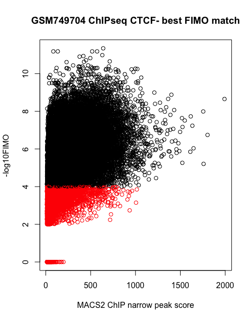

# Introduction

Many kinds of biological activity are regulated by the binding of proteins to their cognate
substrates.  Of particular interest is the sequence-specific binding of transcription factors to
DNA, often in regulatory regions just upstream of the transcription start site of a gene.  These
binding events play a pivotal role in regulating gene expression.

Sequence specificity among closely related binding sites is nearly always incomplete: some variety
in the DNA sequence is routinely observed.  For this reason, these inexact binding sequence patterns
are commonly described as **motifs**, represented numerically as frequency matrices, and visualized
as sequence logos.

Despite their importance in current research, there has been until now, to the best of our
knowledge, no single, annotated, comprehensive collection of publicly available motifs. The current
package attempts to provide such a collection, offering more than ten thousand annotated matrices
from multiple organisms, within the context of the Bioconductor project.  The matrices can be
filtered and selected on the basis of their metadata, used with other Bioconductor packages (for
instance, seqLogo can be used for for visualization) or easily exported for use with standard
software and websites such as those provided by the [MEME
Suite](http://meme.sdsc.edu/meme/doc/meme.html).

Transcription factor binding sites (TFBS) can only be imperfectly predicted from sequence matching
of motif to DNA sequence.  When using MotifDb, please keep in mind that actual and functional TF
binding occurs under the influence of many factors:

  * Chromatin accessibility
  * An appropriate balance of activating and repressing epigenetic influences
  * The presence of the the transcription factor protein in adequate numbers
  * "DNA shape" to complement or substitute for DNA sequence match
  * Cooperativity with other DNA-binding factors, or co-factor interaction

Still, motif-matching to DNA sequence plays an important role in identifying gene regulatory events.

# Quick Start

CTCF is a DNA-binding factor regulating the 3D structure of
chromatin^[CTCF: Master Weaver of the Genome, Philips and Corces, 2009, Cell.  https://www.ncbi.nlm.nih.gov/pmc/articles/PMC3040116].
What is its binding motif?  

The MotifDb **query** function performs a broad, case-neutral text search through all the metadata (all the annotation) for all of
the motifs.  It returns a list of matching motifs.  More information about the metadata is provided below.

We begin with a simple search which retrieves all motifs annotated with the case-neutral string "ctcf".

```{r load MotifDb, query CTCF, prompt=FALSE, message=FALSE, results="show"}
library(MotifDb)
query(MotifDb, "ctcf")
```

Let us refine the search, looking only for human Jaspar 2018, or HOCOMOCO v11 core motifs, category "A". Eliminate "CTCFL".

```{r query CTCF human, prompt=FALSE, message=FALSE, results="show"}
library(MotifDb)
motifs <- query(MotifDb, andStrings=c("CTCF", "hsapiens"),
                orStrings=c("jaspar2018", "hocomocov11-core-A"),
                notStrings="ctcfl")
length(motifs)
```
Motifs from different sources sometimes agree and sometimes differ.  Analytical methods for comparison exist, of which two are

    * Bioconductor package [DiffLogo](https://bioconductor.org/packages/release/bioc/html/DiffLogo.html)
    * Meme Suites [Tomtom](http://meme-suite.org/doc/tomtom.html)

The Biostrings function *consensusString* provides  a quick and sometimes adequate comparison.  In this case, this
reveals that the two motifs are nearly identical:

```{r compare CTCF motifs, prompt=FALSE, message=FALSE, results="show"}
sapply(motifs, consensusString)
```
We can also inspect the similarity visually, using the Bioconductor package [seqLogo](https://bioconductor.org/packages/release/bioc/html/seqLogo.html)

```{r use seqLogo, prompt=FALSE, message=FALSE, results="hide", fig.width = 5, fig.height = 5, fig.show = "hold", out.width = "50%"}
library(seqLogo)
seqLogo(motifs[[1]])  # Hsapiens-jaspar2018-CTCF-MA0139.1
seqLogo(motifs[[2]])  # Hsapiens-HOCOMOCOv11-core-A-CTCF_HUMAN.H11MO.0.A

```

# Beware of False Precision

Though we cannot offer published, peer-reviewed support for this cautionary warning, we urge you to consider
it and its implications.

One is tempted to regard curated motif matrices from respected sources as a
reliable guide to TF/DNA binding potential.  A common strategy is to match motif against sequence, retaining
only matches above a certain threshold fidelity:  for instance a *minScore* for Biostrings::matchPWM, or a p-value
or q-value threshold for [FIMO](http://meme-suite.org/doc/fimo.html).

We explored this topic (unpublished data) using recent high-quality CTCF ChIP-seq and FIMO, for which the default
p-value sequence match threshold is 1e-4.  This scatterplot shows that high-scoring ChIP-seq hits sometimes occur at
binding sites where motif-match scores are low.  We therefore suggest that motif-matching is most useful
in conjuction with other information, for instance open chromatin from highly-resovled experiments (scATAC-seq),
DNAse footprinting, epigenetic markers, and correlated tissue-specific, or cell-type specific gene and
TF protein expression.

```{r ChIP-vs-FIMO, eval=TRUE, echo=FALSE}

```


# References
